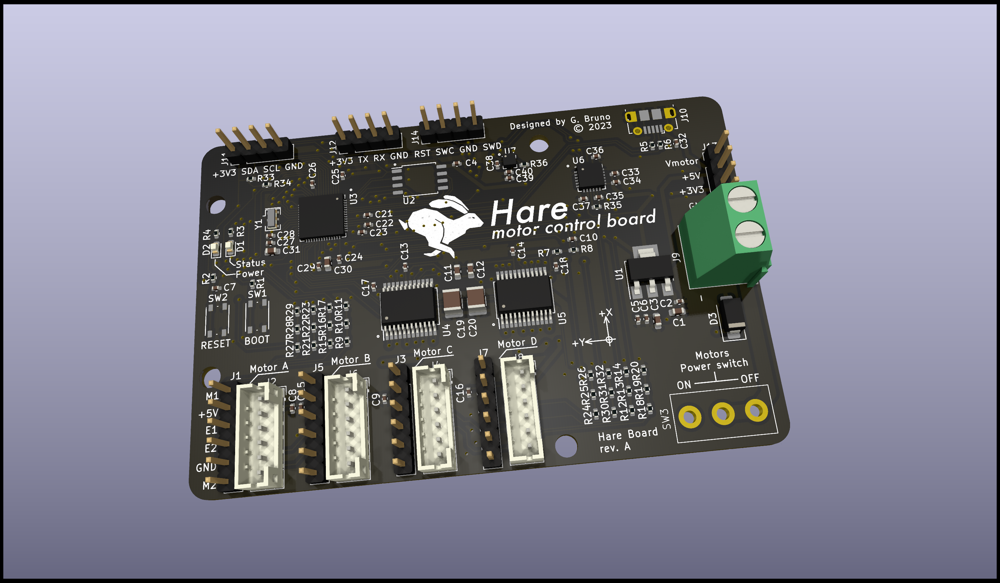
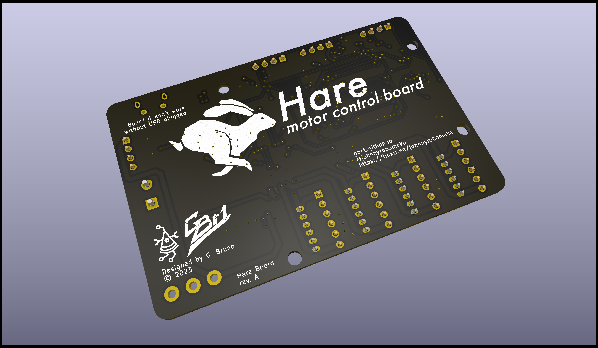

# hare

An open source and open hardware implementation for 4-wheeled mobile robots.

It is compatible with ROS2 and DC brushed motors with encoder.

## Tech specs

- RP2040 MCU

- dual TB6612FNG motor drivers

- MPU6050 6DoF IMU

- LIS3MDL 3 axis magnetometer

- Power switch only for motors power supply

- 10-15V power input

- external connectors for I2C, debugger and UART

- compatibility with common motors with encoder (e.g. [moebiustech gearmotor](https://it.aliexpress.com/item/4000149449495.html?spm=a2g0o.store_pc_groupList.8148356.12.6b414f417HELfJ&pdp_npi=3%40dis%21EUR%21%E2%82%AC%2017%2C51%21%E2%82%AC%2016%2C64%21%21%21%21%21%40211b88ee16852754993946028e1b9d%2110000000459436942%21sh%21IT%210))

## License

The board is under **CC-4.0-BY-SA-NC** but ***dual licensing is available.***

 

For more info contact me.

## Links

- [firmware](https://github.com/gbr1/hare-arduino)

- [website](https://gbr1.github.io)

- [pizzarobotics](https://pizzarobotics.org)
